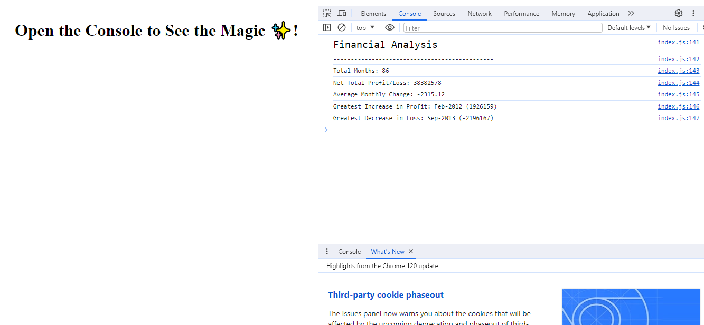

# Unit 4 Challenge: Console Finances

The site can be accessed at https://oleksiieng.github.io/console-application-for-financial-calculations/

The following image shows the web application's appearance and functionality:



## Description

JavaScript code that analyzes the records to calculate each of the following:

* The total number of months included in the dataset.

* The net total amount of Profit/Losses over the entire period.

* The average of the **changes** in Profit/Losses over the entire period.
  * Script tracks what the total change in Profit/Losses are from month to month and then find the average.
  * (`Total/(Number of months - 1)`)

* The greatest increase in Profit/Losses (date and amount) over the entire period.

* The greatest decrease in Profit/Losses (date and amount) over the entire period.

When you open your code in the browser your resulting analysis should look similar to the following:

  ```text
  Financial Analysis 
  ----------------
  Total Months: 86
  Total: $38382578
  Average Change: -2315.12
  Greatest Increase in Profits/Losses: Feb-2012 ($1926159)
  Greatest Decrease in Profits/Losses: Sep-2013 ($-2196167)
  ```


## Table of Contents

- [Installation](#installation)
- [Credits](#credits)
- [License](#license)

## Installation

To install this project:

1. Clone the repository to your local machine using `git@github.com:Oleksiieng/console-application-for-financial-calculations.git`.
2. Open the project in VS Code or any preferred IDE.
3. Ensure you have a live server extension installed, or use a local server to view the web application.

## Credits

Resources consulted for learning purposes:

- [Mozilla Developer Network (MDN)](https://developer.mozilla.org/)
- [W3Schools](https://www.w3schools.com/)
* [Semantic HTML](https://www.w3schools.com/html/html5_semantic_elements.asp)
* [Image `alt` attributes](https://www.w3schools.com/tags/att_img_alt.asp)

## License

This site licensed under the [MIT license](https://opensource.org/licenses/MIT).


